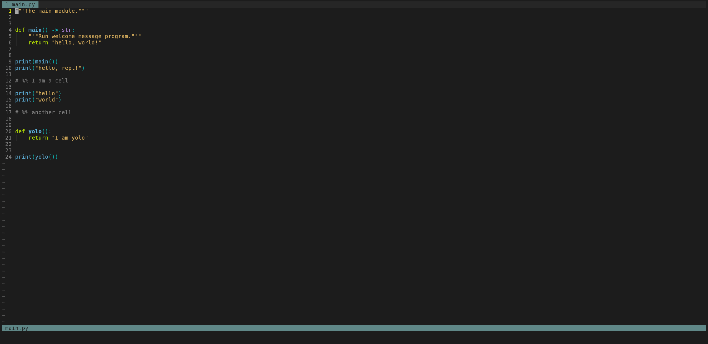

# Neovim REPL

Create, use, and remove an [interactive REPL](https://en.wikipedia.org/wiki/Read%E2%80%93eval%E2%80%93print_loop) within Neovim 0.5.0+.

## Installation

See below for installation instructions for some common Neovim Package managers. For all other package managers, consult your package manager's documentation. Neovim REPL is a [normal Neovim package](https://neovim.io/doc/user/usr_05.html#_adding-a-package).

<details>
  <summary>lazy.nvim</summary>
  <br>

Configuration for <https://github.com/folke/lazy.nvim>

```lua
{
  "pappasam/nvim-repl",
  init = function()
    vim.g["repl_filetype_commands"] = {
      bash = "bash",
      javascript = "node",
      haskell = "ghci",
      python = "ipython --no-autoindent",
      r = "R",
      sh = "sh",
      vim = "nvim --clean -ERM",
      zsh = "zsh",
    }
  end,
  keys = {
    { "<Leader>c", "<Plug>ReplSendCell", mode = "n", desc = "Send Repl Cell" }
    { "<Leader>r", "<Plug>ReplSendLine", mode = "n", desc = "Send Repl Line" }
    { "<Leader>r", "<Plug>ReplSendVisual", mode = "x", desc = "Send Repl Visual Selection" }
  },
}
```

</details>

## Usage



- `:Repl` or `:ReplOpen`: open a terminal and run the repl provided as the argument.
  - _without argument_: open the default shell which is configured by filetype.
- `:Repl env $env_name`: open a python shell with the environment of `$env_name`, only support for [Conda](https://www.anaconda.com/).
- `:Repl arg`: open the default shell and exec the `arg` command.
- `:ReplClose`: close the REPL, if open.
- `:ReplToggle`: if REPL is open, close it. If REPL is closed, open it using either the filetype associated REPL or the configured default REPL.
- `:ReplClear`: clear the REPL, if open.
- `:ReplRunCell`: will run the cell under the cursor and the cursor will jump to next cell.
- `:ReplSendArgs`: will send the arguments passed to the command directly to the REPL.

Several pluggable, dot-repeatable mappings are provided.

- `<Plug>ReplSendLine` send the current line to the REPL.
- `<Plug>ReplSendCell` send the current cell to the REPL.
- `<Plug>ReplSendVisual` send the visual selection to the REPL.

The user should map these pluggable mappings. Example mappings in config using vim filetype:

```vim
nmap <silent> <Leader>c <Plug>ReplSendCell
nmap <silent> <Leader>r <Plug>ReplSendLine
xmap <silent> <Leader>r <Plug>ReplSendVisual
```

## Configuration

- `g:repl_filetype_commands`: map Neovim file types to REPL. E.g., if you automatically want to run a `ipython` REPL for python file types and a "node" REPL for JavaScript file types, your configuration might look like this:

  ```vim
  let g:repl_filetype_commands = {
        \ 'bash': 'bash',
        \ 'javascript': 'node',
        \ 'haskell': 'ghci',
        \ 'python': 'ipython --no-autoindent',
        \ 'r': 'R',
        \ 'sh': 'sh',
        \ 'vim': 'nvim --clean -ERM',
        \ 'zsh': 'zsh',
        \ }
  ```

- `g:repl_default`: set the default REPL if no configured REPL is found in `g:repl_filetype_commands`. Defaults to `&shell`.
- `g:repl_split`: set the REPL window position. `vertical` and `horizontal` respect the user-configured global `splitright` and `splitbottom` settings.

  - `'bottom'`
  - `'top'`
  - `'left'`
  - `'right'`
  - `'horizontal'`
  - `'vertical'` (default)

  If split bottom is preferred, then add below line to configuration.

  ```vim
  let g:repl_split = 'bottom'
  ```

- `g:repl_height`: set REPL window's height (number of lines) if `g:repl_split` set `'bottom'`/`'top'`. Default `split` equally.
- `g:repl_width`: set REPL window's width (number of columns) if `g:repl_split` set `'left'`/`'right'`. Default `vsplit` equally.

## Cells

Cells are denoted by full-line comments that begin with the characters `%%`.

Comments are identified by your buffer's filetype's `'commentstring'`.

See some examples below:

### Python

```python
# %%
print("I am the first cell")
print("I am still the first cell")

# %% anything can follow
print("I am the second cell")
print("I am still the second cell")
print("I am still, still the second cell")
# %%

print("I am the third cell")
```

### Haskell

```haskell
-- %%
putStrLn "I am the first cell"
putStrLn "I am still the first cell"

-- %% anything can follow
putStrLn "I am the second cell"
putStrLn "I am still the second cell"
putStrLn "I am still, still the second cell"
-- %%

putStrLn "I am the third cell"
```

## Full Documentation

From within Neovim, type:

```vim
:help repl
```

## FAQ

### Getting strange errors with Python, please help

One such error might be a `IndentError`. This has to do with quirks related to the default Python interpreter. To get around this, use [`ipython`](https://github.com/ipython/ipython) as your default interpreter for Python files.

Terminal:

```bash
pip install ipython
```

`init.vim`:

```vim
" init.vim
let g:repl_filetype_commands = {'python': 'ipython --no-autoindent'}
```

### Escape doesn't work in Terminal mode

If you find yourself in Terminal mode, use `<C-\><C-n>` instead of `<Esc>` to return to Normal mode.

Type `:help Terminal-mode` and `:help CTRL-\_CTRL-N` for more information.

## Written by

- [Samuel Roeca](https://samroeca.com/)
- [A Cup of Air](https://acupofair.github.io/)
