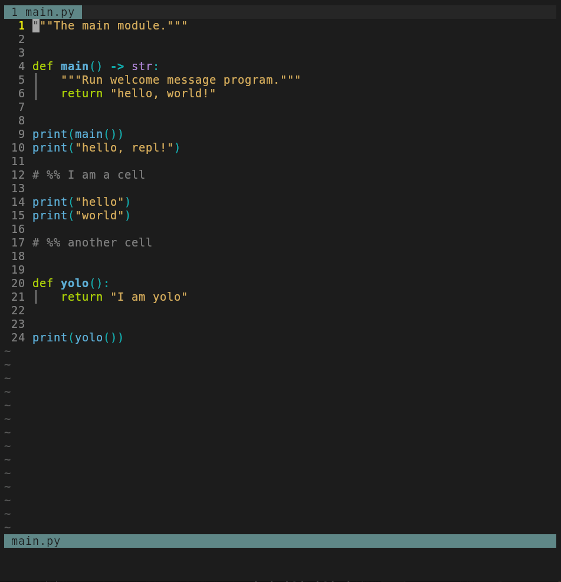

# Neovim REPL

Create, use, and remove [interactive REPLs](https://en.wikipedia.org/wiki/Read%E2%80%93eval%E2%80%93print_loop) within Neovim.

Works with any REPL, but contains custom support for the following REPLs:

- [ipython](https://ipython.readthedocs.io/en/stable): a powerful interactive Python shell
- [aider](https://aider.chat): AI pair programming in your terminal
- [utop](https://opam.ocaml.org/blog/about-utop): a much improved interface to the OCaml toplevel

Documentation is available here: <https://github.com/pappasam/nvim-repl/blob/main/doc/repl.txt>

From within Neovim, type:

```vim
:help repl
```

## Demo


### Aider AI



## Installation

Neovim REPL is a [normal Neovim package](https://neovim.io/doc/user/usr_05.html#_adding-a-package).

<details>
  <summary>lazy.nvim</summary>
  <br>

Configuration for <https://github.com/folke/lazy.nvim>

```lua
{
  "pappasam/nvim-repl",
  init = function()
    vim.g["repl_filetype_commands"] = {
      bash = "bash",
      javascript = "node",
      haskell = "ghci",
      ocaml = {cmd = "utop", repl_type = "utop"},
      r = "R",
      sh = "sh",
      vim = "nvim --clean -ERM",
      zsh = "zsh",
    }
  end,
  keys = {
    { "<Leader>cc", "<Cmd>ReplNewCell<CR>",   mode = "n", desc = "Create New Cell" },
    { "<Leader>cr", "<Plug>(ReplSendCell)",   mode = "n", desc = "Send Repl Cell" },
    { "<Leader>r",  "<Plug>(ReplSendLine)",   mode = "n", desc = "Send Repl Line" },
    { "<Leader>r",  "<Plug>(ReplSendVisual)", mode = "x", desc = "Send Repl Visual Selection" },
  },
}
```

</details>

## FAQ

### Escape doesn't work in Terminal mode

If you find yourself in Terminal mode, use `<C-\><C-n>` instead of `<Esc>` to return to Normal mode.

Type `:help Terminal-mode` and `:help CTRL-\_CTRL-N` for more information.

### Recommended aider configuration

The built-in aider integration overrides aider's `--notifications` and `--notifications-command` for a smooth Neovim integration. All other settings default to the user's aider configuration file and environment. To that end, we recommend:

1. Use `$AIDER_MODEL` to specify your preferred model before opening Neovim.
2. For other settings, please reference the Author's current [aider configuration](https://github.com/pappasam/config/blob/main/dotfiles/.aider.conf.yml) for inspiration.
